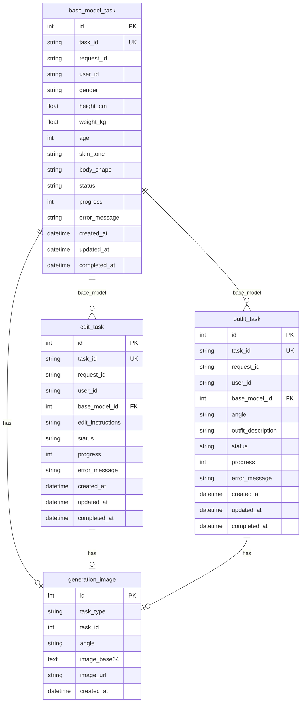

# Design Document

## Overview

重构数据库模型，将单一的 `ai_generation_task` 表拆分为三个独立的任务表，每个表对应一种任务类型。这样可以：
- 更清晰地表达业务模型
- 每个表只包含该任务类型需要的字段
- 便于查询和维护
- 更好地支持未来扩展

## Architecture

```
┌─────────────────┐
│ base_model_task │ ◄── 模特生成任务 (F1)
└────────┬────────┘
         │
    ┌────┴────┐
    │         │
    ▼         ▼
┌─────────┐ ┌───────────┐
│edit_task│ │outfit_task│
└────┬────┘ └────┬──────┘
     │           │
     └─────┬─────┘
           ▼
   ┌──────────────────┐
   │generation_image  │
   └──────────────────┘
```

## Components and Interfaces

### 1. Database Models

#### base_model_task (模特生成任务)
```python
class BaseModelTask(Base):
    __tablename__ = "base_model_task"
    
    id: int                    # 主键
    task_id: str               # Apimart task_id (唯一索引)
    request_id: str            # 请求标识
    user_id: str               # 用户 ID
    gender: str                # 性别
    height_cm: float           # 身高
    weight_kg: float           # 体重
    age: int                   # 年龄
    skin_tone: str             # 肤色
    body_shape: str | None     # 身材类型
    status: TaskStatus         # 任务状态
    progress: int              # 进度
    error_message: str | None  # 错误信息
    created_at: datetime
    updated_at: datetime
    completed_at: datetime | None
```

#### edit_task (模特编辑任务)
```python
class EditTask(Base):
    __tablename__ = "edit_task"
    
    id: int                    # 主键
    task_id: str               # Apimart task_id (唯一索引)
    request_id: str            # 请求标识
    user_id: str               # 用户 ID
    base_model_id: int         # 关联的模特任务 ID (外键)
    edit_instructions: str     # 编辑指令
    status: TaskStatus         # 任务状态
    progress: int              # 进度
    error_message: str | None  # 错误信息
    created_at: datetime
    updated_at: datetime
    completed_at: datetime | None
```

#### outfit_task (穿搭生成任务)
```python
class OutfitTask(Base):
    __tablename__ = "outfit_task"
    
    id: int                    # 主键
    task_id: str               # Apimart task_id (唯一索引)
    request_id: str            # 请求标识
    user_id: str               # 用户 ID
    base_model_id: int         # 关联的模特任务 ID (外键)
    angle: str                 # 视角 (front/side/back)
    outfit_description: str | None  # 服装描述
    status: TaskStatus         # 任务状态
    progress: int              # 进度
    error_message: str | None  # 错误信息
    created_at: datetime
    updated_at: datetime
    completed_at: datetime | None
```

#### generation_image (生成图片)
```python
class GenerationImage(Base):
    __tablename__ = "generation_image"
    
    id: int                    # 主键
    task_type: str             # 任务类型 (model/edit/outfit)
    task_id: int               # 关联的任务内部 ID
    angle: str | None          # 视角
    image_base64: str | None   # Base64 图片 (LONGTEXT)
    image_url: str | None      # 图片 URL
    created_at: datetime
```

### 2. Repository Layer

创建三个独立的 Repository：
- `BaseModelTaskRepository` - 处理模特生成任务
- `EditTaskRepository` - 处理模特编辑任务
- `OutfitTaskRepository` - 处理穿搭生成任务
- `ImageRepository` - 处理图片存储（更新为支持多任务类型）

### 3. Service Layer

更新 `ModelService`：
- 使用对应的 Repository 处理不同任务类型
- 查询任务时根据 task_id 在三个表中查找

## Data Models

### ER Diagram



## Correctness Properties

*A property is a characteristic or behavior that should hold true across all valid executions of a system-essentially, a formal statement about what the system should do. Properties serve as the bridge between human-readable specifications and machine-verifiable correctness guarantees.*

Property 1: Task type isolation
*For any* task creation request, the task SHALL be stored only in its corresponding table (model_task, edit_task, or outfit_task)
**Validates: Requirements 1.1, 1.2, 1.3**

Property 2: Foreign key integrity
*For any* edit or outfit task, the base_model_id SHALL reference an existing model task
**Validates: Requirements 4.1, 4.2**

Property 3: Task query consistency
*For any* task_id, querying the task status SHALL return the same result regardless of which table it's stored in
**Validates: Requirements 3.4**

Property 4: Image association
*For any* completed task, the generated image SHALL be correctly associated with the task via task_type and task_id
**Validates: Requirements 2.4**

## Error Handling

1. **Base model not found**: 创建 edit/outfit 任务时，如果 base_model_id 不存在，返回 404 错误
2. **Task not found**: 查询任务时，如果在所有表中都找不到，返回 404 错误
3. **Database errors**: 使用事务确保数据一致性，失败时回滚

## Testing Strategy

### Unit Tests
- 测试每个 Repository 的 CRUD 操作
- 测试 Service 层的业务逻辑
- 测试外键约束

### Property-Based Tests
使用 hypothesis 库进行属性测试：
- 测试任务创建后能正确查询
- 测试外键关系的完整性
- 测试图片关联的正确性
