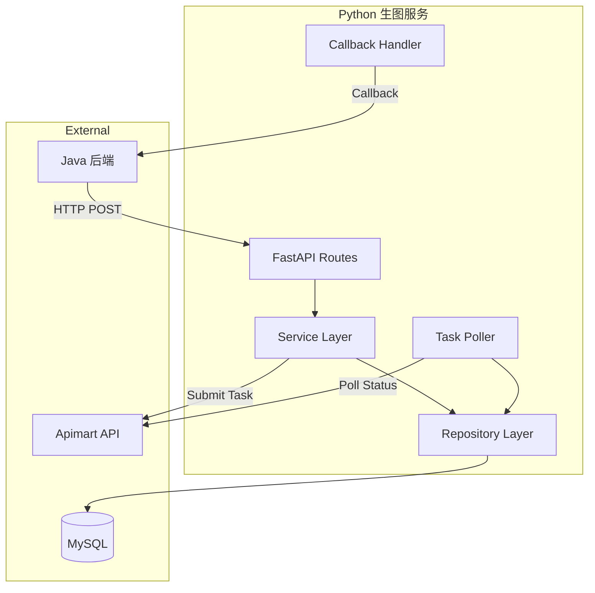

# Design Document: Suitme 数字模特图像生成服务

## Overview

Suitme 数字模特图像生成服务是一个基于 FastAPI 的异步图像生成后端服务。该服务作为 Java 业务后端与 Apimart 图像生成 API 之间的中间层，负责：

1. 接收 Java 后端的生图请求
2. 构建 Prompt 并调用 Apimart API
3. 管理异步任务状态和轮询
4. 存储生成结果并回调通知 Java

技术栈：Python 3.12 + FastAPI + SQLAlchemy + MySQL + httpx

## Architecture



### 分层架构

- **API Layer (routes/)**: FastAPI 路由，处理 HTTP 请求/响应
- **Service Layer (services/)**: 业务逻辑，Prompt 构建，任务编排
- **Repository Layer (repositories/)**: 数据访问，SQL 操作
- **Infrastructure (infra/)**: Apimart 客户端，任务轮询器，回调处理

## Components and Interfaces

### 1. API Routes

```python
# routes/models.py
POST /models/default    # 创建默认模特
POST /models/edit       # 编辑模特
POST /models/outfit     # 穿搭生成

# routes/tasks.py
GET /tasks/{task_id}    # 查询任务状态
```

### 2. Service Layer

```python
# services/model_service.py
class ModelService:
    async def create_default_model(request: DefaultModelRequest) -> TaskResponse
    async def edit_model(request: EditModelRequest) -> TaskResponse
    async def create_outfit(request: OutfitModelRequest) -> TaskResponse

# services/task_service.py
class TaskService:
    async def get_task_status(task_id: int) -> TaskStatusResponse
    async def update_task_status(task_id: int, status: str, progress: int)
    async def complete_task(task_id: int, image_data: bytes)
    async def fail_task(task_id: int, error_message: str)
```

### 3. Repository Layer

```python
# repositories/task_repository.py
class TaskRepository:
    async def create(task: TaskCreate) -> Task
    async def get_by_id(task_id: int) -> Task | None
    async def update_status(task_id: int, status: str, progress: int)
    async def get_pending_tasks() -> list[Task]

# repositories/image_repository.py
class ImageRepository:
    async def create(image: ImageCreate) -> Image
    async def get_by_task_id(task_id: int) -> Image | None
```

### 4. Infrastructure

```python
# infra/apimart_client.py
class ApimartClient:
    async def submit_generation(prompt: str, images: list[str], size: str) -> str
    async def get_task_status(external_task_id: str) -> ApimartTaskStatus

# infra/task_poller.py
class TaskPoller:
    async def start_polling(task_id: int, external_task_id: str)
    async def poll_loop(task: Task)

# infra/callback_handler.py
class CallbackHandler:
    async def notify_java(task_id: int, status: str, image_data: str | None)
```

## Data Models

### Request/Response Models (Pydantic)

```python
class BodyProfile(BaseModel):
    gender: str                    # male/female
    height_cm: float              # 身高 cm
    weight_kg: float              # 体重 kg
    age: int                      # 年龄
    skin_tone: str                # 肤色
    body_shape: str | None = None # 身材类型

class DefaultModelRequest(BaseModel):
    request_id: str
    user_id: str
    user_image_base64: str
    body_profile: BodyProfile

class EditModelRequest(BaseModel):
    request_id: str
    user_id: str
    base_model_task_id: int
    edit_instructions: str

class OutfitModelRequest(BaseModel):
    request_id: str
    user_id: str
    base_model_task_id: int
    angle: Literal["front", "side", "back"]
    outfit_image_base64: str
    outfit_description: str | None = None

class TaskResponse(BaseModel):
    code: int = 0
    msg: str = "accepted"
    data: TaskData

class TaskData(BaseModel):
    task_id: int
    status: str
    angle: str | None = None
```

### Database Models (SQLAlchemy)

```python
class TaskType(str, Enum):
    DEFAULT = "default"
    EDIT = "edit"
    OUTFIT = "outfit"

class TaskStatus(str, Enum):
    SUBMITTED = "submitted"
    PROCESSING = "processing"
    COMPLETED = "completed"
    FAILED = "failed"

class AIGenerationTask(Base):
    __tablename__ = "ai_generation_task"
    
    id: int                        # PK
    request_id: str
    external_task_id: str | None
    type: TaskType
    user_id: str
    base_model_task_id: int | None
    angle: str | None
    status: TaskStatus
    progress: int = 0
    error_message: str | None
    created_at: datetime
    updated_at: datetime
    completed_at: datetime | None

class AIGenerationImage(Base):
    __tablename__ = "ai_generation_image"
    
    id: int                        # PK
    task_id: int                   # FK -> ai_generation_task.id
    angle: str | None
    image_base64: str | None
    image_url: str | None
    created_at: datetime
```


## Correctness Properties

*A property is a characteristic or behavior that should hold true across all valid executions of a system-essentially, a formal statement about what the system should do. Properties serve as the bridge between human-readable specifications and machine-verifiable correctness guarantees.*

### Property 1: 任务创建返回正确响应

*For any* 有效的生图请求（default/edit/outfit），提交后服务 SHALL 返回包含有效 task_id 和 status="submitted" 的响应，HTTP 状态码为 202。

**Validates: Requirements 1.1, 2.1, 3.1**

### Property 2: 无效 Base64 输入拒绝

*For any* 不符合 Data URI 格式的 user_image_base64 或 outfit_image_base64 字符串，服务 SHALL 返回 HTTP 400 和 code=1001。

**Validates: Requirements 1.2**

### Property 3: 无效 body_profile 参数拒绝

*For any* body_profile 中包含超出合理范围值的请求（如负数身高、负数体重、负数年龄），服务 SHALL 返回 HTTP 400 和 code=1001。

**Validates: Requirements 1.3**

### Property 4: 无效 base_model_task_id 拒绝

*For any* 不存在于数据库中的 base_model_task_id，edit 和 outfit 请求 SHALL 返回 HTTP 400 或 404 错误响应。

**Validates: Requirements 2.2, 3.3**

### Property 5: 无效 angle 参数拒绝

*For any* 不在 ["front", "side", "back"] 枚举中的 angle 值，outfit 请求 SHALL 返回 HTTP 400 错误响应。

**Validates: Requirements 3.2**

### Property 6: 任务创建数据持久化

*For any* 成功创建的任务，数据库中 SHALL 存在对应记录，包含正确的 request_id、type、user_id、status="submitted"，且 edit/outfit 任务正确关联 base_model_task_id。

**Validates: Requirements 1.4, 2.3, 3.4, 8.1**

### Property 7: 任务状态转换正确性

*For any* 任务，状态转换 SHALL 遵循：submitted → processing → completed/failed，不允许跳过中间状态或逆向转换。

**Validates: Requirements 4.1, 4.2, 4.3, 4.4**

### Property 8: 任务查询返回正确信息

*For any* 存在的 task_id，查询 SHALL 返回当前状态和进度；若状态为 completed，响应 SHALL 包含图片信息（Base64 或 URL）。

**Validates: Requirements 5.1, 5.3**

### Property 9: 不存在任务查询返回 404

*For any* 不存在于数据库中的 task_id，查询 SHALL 返回 HTTP 404 和 code=1003。

**Validates: Requirements 5.2**

### Property 10: 任务完成图片持久化

*For any* 完成的任务，ai_generation_image 表中 SHALL 存在对应记录，包含 task_id 和图片数据（image_base64 或 image_url 至少一个非空）。

**Validates: Requirements 1.5, 8.2**

### Property 11: 回调包含正确信息

*For any* 完成或失败的任务，回调请求 SHALL 包含 task_id、status、type，且请求头包含身份验证 token。

**Validates: Requirements 7.1, 7.3**

### Property 12: 任务时间戳正确更新

*For any* 任务状态更新，updated_at 字段 SHALL 被更新；任务完成时，completed_at 字段 SHALL 被设置。

**Validates: Requirements 8.3, 8.4**

## Error Handling

### 错误码定义

| code | HTTP Status | 含义 |
|------|-------------|------|
| 0 | 200/202 | 成功 |
| 1001 | 400 | 参数错误 |
| 1002 | 502 | Apimart 调用失败 |
| 1003 | 404 | 任务不存在 |
| 1004 | 500 | 内部异常 |

### Apimart 错误处理策略

```python
class ApimartErrorHandler:
    async def handle_error(self, status_code: int, task: Task):
        match status_code:
            case 400:
                await self.fail_task(task, "apimart_param_error")
            case 401:
                await self.fail_task(task, "apimart_auth_error")
                await self.alert("Apimart 鉴权失败")
            case 402:
                await self.fail_task(task, "apimart_insufficient_balance")
                await self.alert("Apimart 余额不足")
            case 429:
                await self.retry_with_backoff(task, max_retries=3, base_delay=1)
            case _ if status_code >= 500:
                await self.retry_with_exponential_backoff(task, max_retries=5)
```

### 重试策略

- **429 频率限制**: 固定间隔重试，最多 3 次，间隔 1-2 秒
- **5xx 服务器错误**: 指数退避重试，最多 5 次，初始间隔 1 秒，最大间隔 32 秒
- **回调失败**: 指数退避重试，最多 3 次

## Testing Strategy

### 测试框架

- **单元测试**: pytest + pytest-asyncio
- **属性测试**: hypothesis (Python PBT 库)
- **HTTP 测试**: httpx + pytest-httpx

### 单元测试覆盖

1. **Validation Tests**
   - Base64 格式验证
   - body_profile 范围验证
   - angle 枚举验证

2. **Service Tests**
   - 任务创建流程
   - 状态更新逻辑
   - 错误处理分支

3. **Repository Tests**
   - CRUD 操作
   - 查询条件

### 属性测试策略

每个正确性属性对应一个属性测试，使用 hypothesis 生成随机输入：

```python
from hypothesis import given, strategies as st

# Property 2: 无效 Base64 输入拒绝
@given(st.text().filter(lambda x: not is_valid_data_uri(x)))
def test_invalid_base64_rejected(invalid_base64):
    """**Feature: suitme-image-generation, Property 2: 无效 Base64 输入拒绝**"""
    response = client.post("/models/default", json={...})
    assert response.status_code == 400
    assert response.json()["code"] == 1001

# Property 3: 无效 body_profile 参数拒绝
@given(st.builds(BodyProfile, height_cm=st.floats(max_value=-1)))
def test_invalid_body_profile_rejected(invalid_profile):
    """**Feature: suitme-image-generation, Property 3: 无效 body_profile 参数拒绝**"""
    ...
```

### 测试配置

- hypothesis 最小运行次数: 100
- 测试数据库: SQLite in-memory
- Apimart Mock: pytest-httpx fixtures
